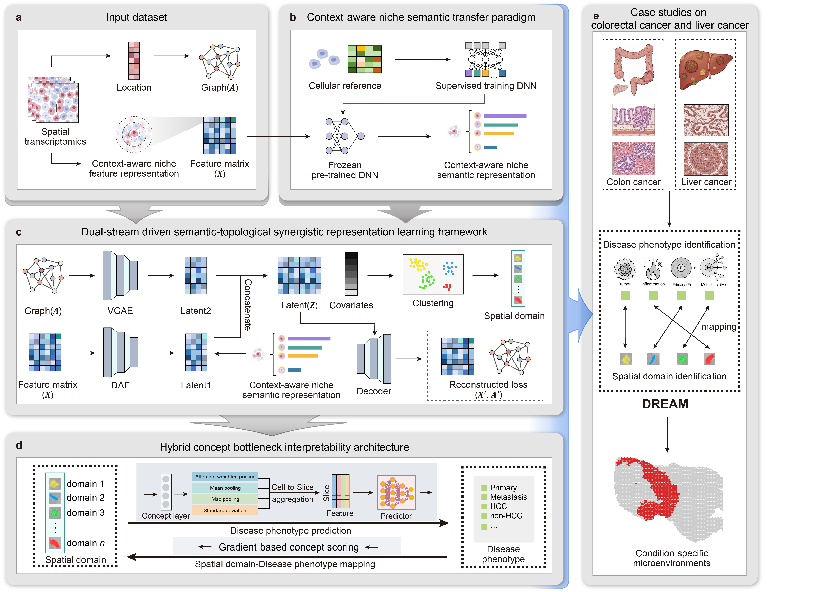

Welcome to DREAM’s documentation!
===================================

Interpretable attribution of clinical phenotypes to condition-specific microenvironment via concept-driven modeling
------------------------------------------------------------------------------------------------------------------

( Document being updated... )

=====================================================================================================================================================

.. toctree::
   :maxdepth: 1

   
   RUN_Spleen
   RUN_CRCLM

Overview of DREAM
====================

The spatial organization of multicellular ecosystems underpins tissue homeostasis and disease progression. Single-cell atlases have extensively characterized cellular compositions and their pathological remodeling. However, single-cell omics technology separates molecular profiles from their native spatial context. This separation makes it difficult to identify condition-specific microenvironments associated with pathological phenotypes. Here, we present DREAM (Dual-stream Representation & Explicit Attribution Modeling), a computational framework for interpretable attribution via concept-driven modeling. DREAM leverages context-aware semantic transfer to construct robust niche semantic representations, synergistically encoding intrinsic biological semantics and extrinsic spatial topology through a dual-stream architecture. By incorporating a concept bottleneck mechanism, the framework maintains a balance between clinical predictive accuracy and biological interpretability. DREAM was benchmarked across five spatial proteomics and transcriptomics datasets. It consistently outperformed existing methods in identifying reproducible tissue domains. Applied to colorectal and liver cancer cohorts, condition-specific microenvironments were characterized, and slice-level pathological phenotypes were accurately predicted. These results were supported by downstream computational analyses. Additionally, the identified microenvironments were shown to be significant prognostic indicators, and key immune-active regions, such as tertiary lymphoid structures (TLS), were accurately localized. Ultimately, DREAM demonstrates how concept-driven modeling can highlight potential pathological associations from complex spatial omics data, providing a novel computational perspective for understanding spatial heterogeneity in complex diseases.
