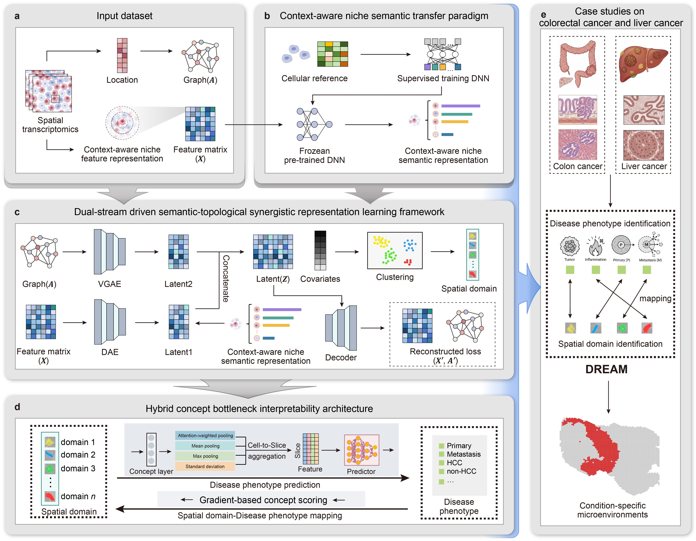

Welcome to DREAM’s documentation!
===================================

DREAM identifies condition-specific microenvironments by explicitly linking spatial domains to clinical phenotypes 
------------------------------------------------------------------------------------------------------------------

( Document being updated... )

=====================================================================================================================================================

.. toctree::
   :maxdepth: 1

   RUN_Spleen
   RUN_CRCLM

Overview of DREAM
====================

The spatial organization of multicellular ecosystems underpins tissue homeostasis and disease progression. Given the high spatial heterogeneity of complex diseases, accurately identifying condition-specific microenvironments linked to clinical phenotypes is a prerequisite for uncovering disease-driving mechanisms and formulating precision medicine strategies. However, current spatial omics computational methods are largely limited to descriptive spatial clustering; they lack the interpretability required to explore pathological associations, struggling to identify and map heterogeneous spatial domains directly to macroscopic clinical outcomes. Here, we present DREAM (Dual-stream Representation & Explicit Attribution Modeling), a computational framework for interpretable attribution via concept-driven modeling. First, DREAM identifies spatial domains by constructing context-aware niche representations, synergistically encoding biological semantics and spatial topology. Subsequently, utilizing a spatially-tailored concept bottleneck mechanism, DREAM explicitly links these spatial domains to macroscopic clinical outcomes. By achieving robust slice-level phenotype prediction and quantitative attribution, this linkage effectively translates purely computational spatial domains into biologically meaningful, condition-specific microenvironments. Extensive benchmarking across five multi-scale spatial transcriptomic and proteomic datasets demonstrates DREAM’s superior performance in identifying highly reproducible tissue domains. Applied to clinical cohorts, DREAM accurately predicted slice-level disease states and explicitly identified the microenvironments of colorectal cancer metastasis by pinpointing the spatial convergence of tumor stemness and stromal remodeling. Furthermore, in liver cancer, the framework autonomously localized functional tertiary lymphoid structures (TLS) in an unsupervised manner, yielding a compact, highly prognostic spatial signature. Ultimately, DREAM demonstrates how concept-driven modeling can translate complex spatial omics data into interpretable, data-driven pathological hypotheses, providing a novel computational perspective for understanding spatial heterogeneity in complex diseases.
